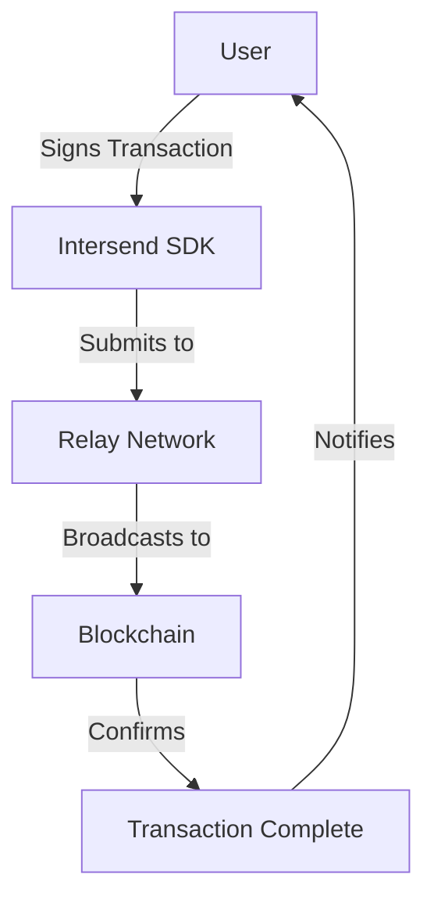

# Images and Media

Adding visual elements to your documentation can significantly improve comprehension and user engagement. This guide shows how to add images, diagrams, and other media to your Intersend documentation.

## Adding Images

Images in Vocs documentation can be added using standard Markdown syntax or through HTML/JSX for more control.

### Basic Image Syntax

```md

```

### Placing Images in Your Documentation

1. Place your images in the `public/images` directory
2. Reference them using paths relative to the public directory:

```md

```

### Styled Images

For more control over image display, you can use HTML with styling:

```jsx

```

## Image Captions

Add captions below your images for additional context:

```jsx
<figure>
  
  <figcaption>Fig 1: Flow of a transaction through the Intersend network</figcaption>
</figure>
```

## Diagrams

You can add diagrams using Mermaid syntax for flowcharts, sequence diagrams, and more:



## Responsive Images

For images that should scale with viewport size:

```jsx
<div style={{ maxWidth: '100%', overflow: 'auto' }}>
  
</div>
```

## Dark and Light Mode Images

For different images based on color scheme:

```jsx
<>
  
  
</>
```

## Asset Organization

Keep your images organized using a logical structure:

```
public/
└── images/
    ├── logos/
    │   ├── intersend-logo.svg
    │   └── partner-logos/
    ├── diagrams/
    │   ├── architecture.png
    │   └── flow-charts/
    ├── screenshots/
    │   ├── dashboard.png
    │   └── wallet-view.png
    └── icons/
        └── file-types/
```

## Image Best Practices

1. **Optimize image sizes** before adding them to documentation
2. **Use SVG** for logos and icons when possible
3. **Provide meaningful alt text** for accessibility
4. **Keep a consistent style** across diagrams and screenshots
5. **Use proper resolution** images (2x for high-DPI displays)
