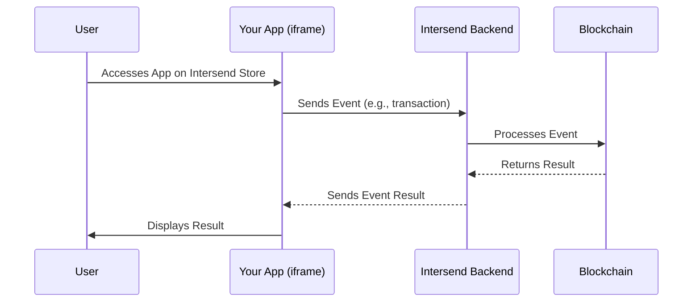

## Brief Overview

Intersend App Store is a non-custodial app marketplace that provides users with modular applications connected through a unified wallet.

Developers can leverage Intersend APIs, Iframe, and, soon, an SDK to obtain necessary permissions and connect to users' dedicated wallets. Intersend facilitates easy transactions for both Web3 and Web2 users, enabling them to send or receive any cryptocurrency seamlessly and onboard into the ecosystem efficiently.

## Main Use Cases

- **Easy Onboarding**: Simplifies the process for users to make single-click payments by connecting their wallets.
- **Unified Wallet Management**: Centralized control and management of crypto assets through a single wallet interface.
- **Omnichain Compatibility**: Supports multiple blockchain networks, enabling seamless cross-chain transactions.
- **Gas-Free Transactions**: Allows certain transactions to be conducted without gas fees, improving user experience.

## Ways to Integrate

### 1. You have an existing web app

If you have an existing web application, we can embed your app as an iframe within the Intersend App Store. Your app will communicate with Intersend through a standardized messaging system.

The iframe sends events, such as making a transaction with details to the deposit address. We capture and process these events on the backend and send the response back to the developer's iframe or web app, which then displays the details to the frontend.



#### Integration Steps

1. Prepare Your App: Ensure your app can run within an iframe and handle postMessage communication.

2. Install Required Dependencies

```javascript
npm install viem
# or
yarn add viem
```

3. Implement Transaction Preparation Function

```javascript
import { parseEther, encodeFunctionData } from 'viem';

const prepareTransaction = (to, amount, tokenAddress) => {
  // Encode the function call for a token transfer
  const data = encodeFunctionData({
    abi: [{
      inputs: [
        { name: 'recipient', type: 'address' },
        { name: 'amount', type: 'uint256' }
      ],
      name: 'transfer',
      type: 'function'
    }],
    args: [to, parseEther(amount)]
  });

  return {
    to: tokenAddress,
    data,
    value: '0' // Use '0' for token transfers
  };
};
```

4. Implement Message Handling: Set up event listeners for messages from Intersend:

```javascript
useEffect(() => {
  const handleMessage = (event) => {
    if (event.origin !== "https://app.intersend.io") return;

    const { id, result } = event.data;
    if (result.success) {
      console.log('Transaction successful:', result.data);
      // Update your UI to show success
    } else {
      console.error('Transaction failed:', result.message);
      // Update your UI to show failure
    }
  };

  window.addEventListener('message', handleMessage);
  return () => window.removeEventListener('message', handleMessage);
}, []);
```

5. Send Transaction

```javascript
const sendTransaction = (recipient, amount, tokenAddress) => {
  const txData = prepareTransaction(recipient, amount, tokenAddress);

  window.parent.postMessage({
    method: 'sendTransactions',
    params: {
      txs: [txData],
      chainId: '137' // Replace with your target chain ID
    },
    id: `tx-${Date.now()}` // Unique ID for this transaction
  }, 'https://app.intersend.io');
};
```

6. Update your UI

```javascript
// the following snippet is provided as a reference

return (
  <div>
    <input 
      type="text" 
      placeholder="Recipient Address" 
      onChange={(e) => setRecipient(e.target.value)} 
    />
    <input 
      type="text" 
      placeholder="Amount" 
      onChange={(e) => setAmount(e.target.value)} 
    />
    <button onClick={() => sendTransaction(recipient, amount, tokenAddress)}>
      Send Transaction
    </button>
    {/* Display transaction status here */}
  </div>
);
```

7. The app goes through our testing and approval process.

8. Once approved, your app becomes available to users in the Intersend App Store.


### 2. Bring Your Own APIs

Developers can leverage Intersend's custom-made branded UI by providing their own APIs. This integration method allows you to maintain your backend while taking advantage of Intersend's user-friendly interface and user base.

#### How It Works

1. You develop and host the required APIs for your app (detailed below).
2. You provide Intersend with your API endpoints and any necessary authentication details.
3. Intersend creates a new app within our ecosystem, integrating your APIs with our custom UI.
4. The app goes through our testing and approval process.
5. Once approved, your app becomes available to users in the Intersend App Store.

#### Required APIs

To integrate your app with Intersend, you need to provide the following APIs:

##### 1. JWT Verification (Optional)
**Endpoint:** `/jwt-verify`

This optional endpoint enhances security by verifying the JWT token sent by Intersend.

**Request:**
```json
{
  "token": "eyJhbGciOiJIUzI1NiIsInR5cCI6IkpXVCJ9..."
}
```

**Response:**
```json
{
  "valid": true,
  "userId": "user123"
}
```


##### 2. App Details
**Endpoint:** `/details`

Provides information about your app for display in the Intersend UI.

**Response:**
```json
{
  "name": "YourApp",
  "description": "A brief description of your app",
  "logo": "https://yourapp.com/logo.png",
  "status": "active",
  "supportedCurrencies": ["BTC", "ETH", "USDT"],
  "supportedNetworks": ["Bitcoin", "Ethereum", "Tron"]
}
```

##### 3. Get Min/Max Limits
**Endpoint:** `/get-min-max`

Retrieves the minimum and maximum transaction limits for your app.

**Request:**
```json
{
  "fromCurrency": "BTC",
  "toCurrency": "ETH",
  "fromNetwork": "Bitcoin",
  "toNetwork": "Ethereum"
}
```

**Response:**
```json
{
  "min": "0.001",
  "max": "10",
  "fromCurrency": "BTC"
}
```

##### 4. Get Exchange Rate
**Endpoint:** `/get-rate`

Fetches the current exchange rate for a given currency pair.

**Request:**
```json
{
  "fromCurrency": "BTC",
  "toCurrency": "ETH",
  "fromNetwork": "Bitcoin",
  "toNetwork": "Ethereum",
  "amount": "1"
}
```

**Response:**
```json
{
  "rate": "15.5",
  "fromAmount": "1",
  "toAmount": "15.5",
  "fromCurrency": "BTC",
  "toCurrency": "ETH"
}
```

##### 5. Create Transaction
**Endpoint:** `/create-transaction`

Initiates a new transaction.

**Request:**
```json
{
  "userId": "user123",
  "fromCurrency": "BTC",
  "toCurrency": "ETH",
  "fromNetwork": "Bitcoin",
  "toNetwork": "Ethereum",
  "fromAmount": "1",
  "toAmount": "15.5",
  "type": "swap"
}
```

**Response:**
```json
{
  "transactionId": "tx123",
  "payoutAddress": "0x1234...5678",
  "network": "Bitcoin",
  "amount": "1",
  "userId": "user123",
  "type": "swap",
  "status": "pending"
}
```

##### 6. Transaction Status
**Endpoint:** `/status`

Checks the status of a transaction.

**Request:**
```json
{
  "transactionId": "tx123"
}
```

**Response:**
```json
{
  "transactionId": "tx123",
  "status": "completed",
  "fromAmount": "1",
  "toAmount": "15.5",
  "fromCurrency": "BTC",
  "toCurrency": "ETH",
  "timestamp": "2024-07-15T12:34:56Z"
}
```


##### 7. Transaction History
**Endpoint:** `/history`

Retrieves the transaction history for a user.

**Request:**
```json
{
  "userId": "user123",
  "page": 1,
  "limit": 10
}
```

**Response:**
```json
{
  "transactions": [
    {
      "transactionId": "tx123",
      "fromAmount": "1",
      "toAmount": "15.5",
      "fromCurrency": "BTC",
      "toCurrency": "ETH",
      "status": "completed",
      "timestamp": "2024-07-15T12:34:56Z"
    },
    // ... more transactions
  ],
  "totalCount": 45,
  "currentPage": 1
}
```

##### 8. FAQ
**Endpoint:** `/faq`

Provides frequently asked questions and answers about your app.

**Response:**
```json
{
  "faqs": [
    {
      "question": "What is the minimum transaction amount?",
      "answer": "The minimum transaction amount varies depending on the cryptocurrency. For BTC, it's 0.001 BTC."
    },
    // ... more FAQs
  ]
}
```

### Intersend Custom UI

Once you provide these APIs, Intersend will create a custom UI for your app within our ecosystem. Here's an example of how this UI might look:


Our UI is designed to be intuitive and user-friendly, guiding users through the process of using your app within the Intersend ecosystem. It typically includes sections for:

- Selecting currencies and networks
- Displaying exchange rates
- Entering transaction amounts
- Showing transaction status and history
- Accessing FAQs and support

### Integration Process

1. Develop and host the required APIs on your backend.
2. Provide Intersend with your API endpoints and any necessary authentication details.
3. Intersend creates a new app in our ecosystem, integrating your APIs with our custom UI.
4. We provide you with a test environment to ensure everything works correctly.
5. After your approval and our final checks, your app goes live on the Intersend App Store.

### Customization Options

While our standard integration covers most use cases, we understand that some apps may have unique requirements. If you need additional customization, please let us know. We can explore options such as:

- Adding app-specific fields to the transaction process
- Modifying the user flow to better suit your app's requirements
- Further customizing the UI to match your brand guidelines
- Integrating additional APIs specific to your app's functionality

By leveraging this "Bring Your Own APIs" integration method, you can maintain control over your backend logic while benefiting from Intersend's user base and intuitive interface. This approach offers a balance between customization and ease of integration, allowing you to quickly bring your app to the Intersend App Store.


### Smart Contracts

We use ERC-4337 smart contracts to facilitate secure and efficient transactions within the Intersend ecosystem.

## Contact Information

For further questions, please reach out to [hello@intersend.io](mailto:hello@intersend.io) or @erturkarda on Telegram.
