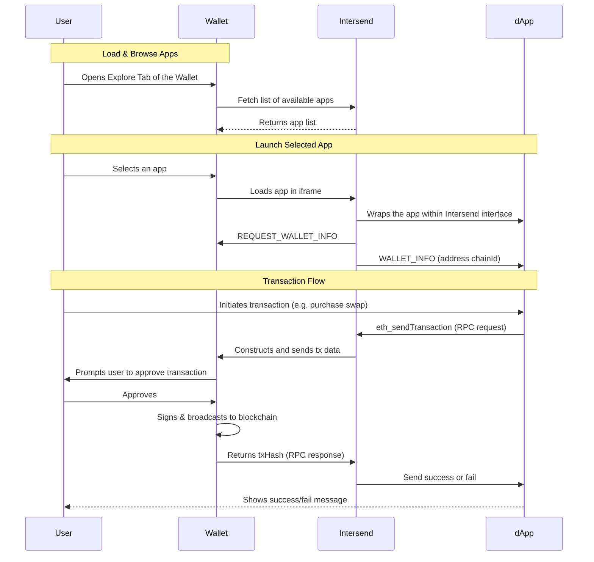

# Wallets & WaaS Overview

> **This guide is for you if:**
> 
> You provide wallet infrastructure (MPC, custodial, non-custodial) (e.g., UniversalX, MetaMask, Phantom) and want to:
> - Offer curated dApps without maintaining it yourself
> - Keep full control over security and UX
> - Automatically integrate new apps added to Intersend

## Demo

See a demo of an Intersend-powered wallet:

<iframe
  width="560"
  height="315"
  src="https://www.youtube.com/embed/tb8bpSt_qAY?si=CrAPF8gv57AiUIkd"
  title="YouTube video player"
  frameBorder="0"
  allow="accelerometer; autoplay; clipboard-write; encrypted-media; gyroscope; picture-in-picture"
  allowFullScreen
></iframe>

[Github Repo](https://github.com/intersend/demo-wallet)

Turn your wallet into a Web3 gateway using Intersend's universal connector. Embed dApps directly into your interface while maintaining full control over security and user experience.

## Why Intersend?

- **Zero Maintenance**
  New apps become automatically available to your users - no integration work required
- **Security First**
  All transactions use your existing signing infrastructure - keys never leave your environment
- **Customizable Curation**
  Choose which apps to display and control their presentation

---

## How It Works

Under the hood, Intersend provides an iframe-based connector that mediates communication between your wallet and apps available on Intersend. Your wallet remains in control of signing, transaction approvals, and chain selection while Intersend relays messages securely via `postMessage`.

## Security Architecture

The SDK implements a secure messaging protocol between the embedded app and your wallet:

- **Isolated Iframes:**
  All third-party dApps are sandboxed within an iframe managed by Intersend. This prevents unauthorized access to your code or your users' private keys.

- **No Private Key Exposure:**
  Any signature or transaction request is forwarded to your wallet's internal signing logic. Keys never leave your environment.

- **Origin Validation:**
  The Intersend SDK verifies the origin of incoming messages. Suspicious or unknown sources are ignored.

## Contact Us

- Email: hello@intersend.io
- Telegram: @erturkarda
